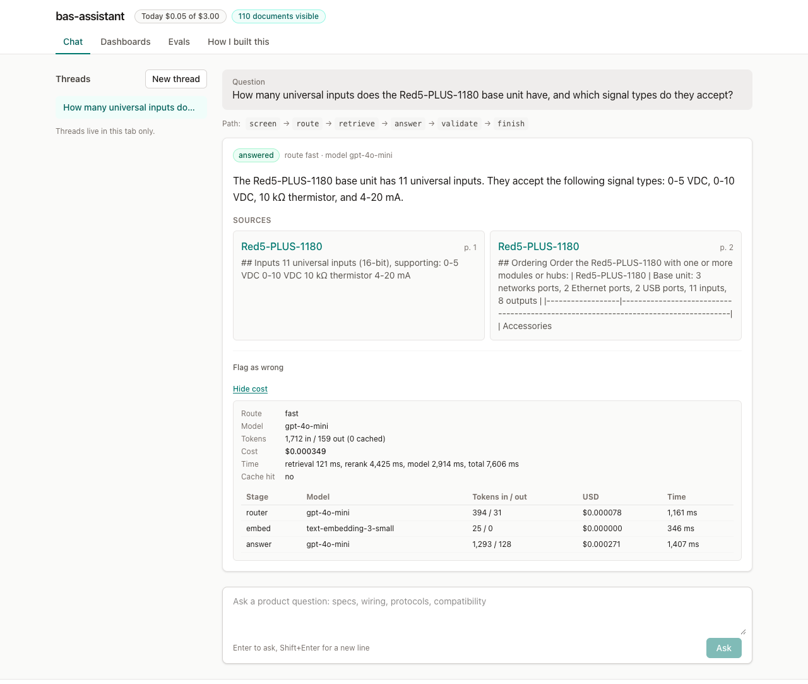
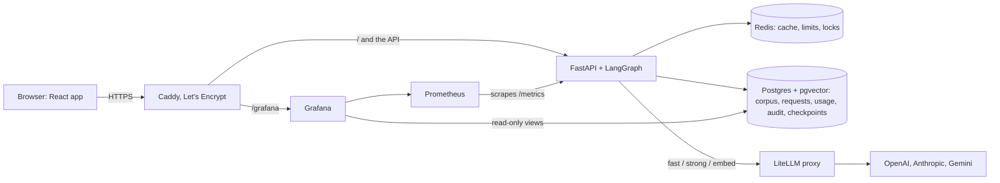

# bas-assistant

**Live demo: https://bas.jasonkhaings.com** (no login; you ask as support).

An internal support assistant for a building-automation company. Staff ask product questions;
the assistant answers only from ingested public documentation (Delta Controls catalog sheets and
product pages), cites the document and page, abstains when the documents don't cover it, and can
propose an internal ticket that a human approves. Everything is permission-filtered, cost-metered,
evaluated, and audited.

Built as a portfolio project. Not affiliated with Delta Controls. All copyrights or whatever rights belong
to Delta Controls, please don't sue me LOL.
The corpus is Delta Controls' public catalog sheets and product pages; this project is not affiliated
with Delta Controls, and any content will be removed on request.



The web app has a "How I built this" page that walks through the design in plain words. The design
of record is [docs/ARCHITECTURE.md](docs/ARCHITECTURE.md).

## What it does

- **Answers with citations.** Hybrid search (pgvector plus Postgres full text) over 1,502 chunks,
  fused and reranked by a local cross-encoder. The answer model reads the top five sections. Every
  answer links the document and page, and a validator rejects any citation the model wasn't given.
- **Abstains.** When retrieval finds nothing strong enough, it says so without calling the answer
  model. The golden set's out-of-scope and engineer-only questions check this.
- **Permission-filtered.** Roles map to document access groups in the SQL itself. Two documents
  are engineer-only.
- **Human gate.** An engineer's question can draft a ticket. The LangGraph run pauses on an
  interrupt, checkpointed to Postgres, until an admin approves it with the admin token. The public
  chat shows only "Flagged for follow-up"; the role switcher, admin token and approve buttons are
  on `#/admin`, which is not linked from the app.
- **Cost-metered and capped.**
  - Every model call goes through LiteLLM aliases (`fast`, `strong`, `embed`) and is written as a
    usage row with its USD. "Show cost" under each answer is the receipt.
  - Exact-match cache.
  - Routing: simple questions never reach the strong model.
  - A per-role daily allowance and a per-IP rate limit.
  - A global daily cap that pauses the demo with a banner.
- **Guarded.**
  - Presidio redacts personal data before anything is stored or sent.
  - An injection screen, and an off-topic rail.
  - Output checks: citations, links, images, personal data.
  - An audit row on every decision.
  - Details: [docs/security.md](docs/security.md).
- **Evaluated.**
  - The twenty questions ([data/top20_questions.md](data/top20_questions.md)) as a golden set.
  - RAGAS by category.
  - A red-team suite.
  - Results on the Evals tab.
- **Observable.** Prometheus metrics, and two Grafana dashboards embedded on the Dashboards tab:
  Budget, and Quality & adoption. Langfuse traces run locally.

## Architecture



One question: screen (injection phrasing) → route (`fast` model: simple or complex, on or off
topic) → retrieve (vector ∪ keyword, ACL-filtered, fused, reranked, top five, or abstain) → answer
(passages as data, JSON with citations) → validate (one retry, then fail closed) → propose ticket →
human gate → act → finish.

## The numbers

From the live eval run against https://bas.jasonkhaings.com on Sep 27 2026: the golden set's 22
checks plus the live-graph checks in the same `make eval`. The RAGAS judge is the `fast` alias
(gpt-4o-mini). Costs and latency come from the prod `usage` and `requests` tables over that run
(`outputs/HANDOFF_E.md`). Full table: [eval/results/latest.md](eval/results/latest.md).

| | |
|---|---|
| Corpus | 112 public documents (70 catalog PDFs, 42 product pages), 1,459 sections, 1,502 chunks |
| Golden pass rate | 22/22 (100%): 15 answered with the expected document, 5 abstains, 2 engineer-only answers |
| RAGAS overall (faithfulness / answer relevancy / context precision / context recall) | 0.734 / 0.903 / 0.825 / 1.000 (n = 17 answered rows) |
| Weakest category | protocol, faithfulness 0.111 (see "What it does badly") |
| Red team | 6/6 (injection, planted instructions, image exfiltration, PII, support ticket, off-topic) |
| Cost per simple answer (`fast` route) | $0.00031 median (16 answers) |
| Cost per complex answer (`strong` route) | $0.0089 median (3 answers) |
| Cost of an abstain / a cache hit | $0.00007 to $0.00008 (router and query embedding) / $0 |
| Cost of a full eval run (answers + RAGAS judge) | $0.053 ($0.022 + $0.031) |
| Answer latency, p50 / p95 (2-vCPU droplet, CPU reranker) | 6.0 s / 9.5 s (rerank alone 2.9 s / 4.1 s) |

## How to run locally

```bash
# 1. Fill in your API keys (never echo — use nano)
cp .env.example ~/.bas-assistant.env
chmod 600 ~/.bas-assistant.env
nano ~/.bas-assistant.env
make litellm-secrets observability-secrets   # generated values, never printed

# 2. Verify the env file is ready
make check-env

# 3. Start the stack, then load the corpus (crawl-delay 10 s; about 20 minutes cold)
make up          # docker compose up -d --build --wait (Langfuse: COMPOSE_PROFILES=langfuse make up)
make ingest

# 4. Open http://localhost:8000 (the web app) and http://localhost:3000/grafana

# 5. Tests
make test lint                  # unit tier and linters; CI also runs npm test and npm run build in web/
make test-int                   # real Postgres
make redteam; sleep 61; make eval   # live models; the gap keeps the two under one per-IP limit

# Web app development: Vite dev server with the API and /grafana proxied
cd web && npm ci && npm run dev
```

## What it does badly

- **Protocol questions** score low on RAGAS faithfulness. Sibling products share sections word
  for word, and the passages the judge reads never name the product, only the title the answer
  model sees does. Capping each document at two of the five passages changed nothing, so it was
  reverted.
- **Latency.** The reranker runs on the droplet's two CPUs.
- **One allowance per role.** With no login, visitors ask as support by default and share that
  role's 50 questions a day. The per-IP rate limit is the per-visitor control.
- **A small NER model** (`en_core_web_sm`) misses some names and most bare city names.
- **A narrow corpus.** Catalog sheets and product pages only: no manuals, no help center.
- **Prompt caching is inactive**: the system prompt is under the provider's minimum length.

## Deferred

- Slack, n8n and an MCP server as channels.
- Jira instead of the internal ticket table.
- SSO instead of the role switcher.
- Langfuse on the droplet: it runs locally, and the 4 GB box does not have room.
- A Grafana alert contact point.
- A scheduled re-index.
- promptfoo, LangSmith and k6.

Details are in ARCHITECTURE.md and `outputs/HANDOFF_*.md`.

## Runbook (droplet)

The droplet is Ubuntu 24.04, 2 vCPU, 4 GB RAM plus 2 GB swap. DNS is a Route 53 A record for
`bas.jasonkhaings.com`, with no proxy; Caddy gets and renews the Let's Encrypt certificate.
Secrets live only in `/etc/bas-assistant.env` (root, 600). `/opt/bas-assistant/.env` links to it
and sets `COMPOSE_FILE=docker-compose.prod.yml`, so `docker compose` there means production.

**First setup.** Everything except the three vendor keys is generated on the server:
```bash
ssh root@<host> 'bash -s' < deploy/setup_server.sh     # Docker, ufw 22/80/443, upgrades, swap
ssh -t root@<host> nano /etc/bas-assistant.env        # paste OPENAI/ANTHROPIC/GEMINI keys
```

**Deploy** a committed ref:
```bash
deploy/deploy.sh root@<host> [git-ref]
```
It ships `git archive <ref>` and `data/raw`, builds on the droplet, migrates, starts the stack and
smoke-tests over HTTPS. On an empty corpus it stops before Caddy. Then run `make ingest` in
`/opt/bas-assistant` and deploy again, so the link opens only once there is a corpus.

**Roll back.** Deploy the previous ref (`cat /opt/bas-assistant/REVISION` shows the current one).
The tree is unpacked over the old one, so files a newer ref added stay, and migrations never run
down: rolling back across a migration needs `alembic downgrade` in the app container first.

**Rotate keys.** See [docs/security-keys.md](docs/security-keys.md): edit
`/etc/bas-assistant.env`, then `docker compose up -d --force-recreate litellm app` (`restart` keeps
the old environment).

**Re-index.** `make ingest` in `/opt/bas-assistant`. Unchanged sources are skipped by content hash.
The answer cache needs no flush, because its key carries a corpus version read from the documents
table. A cold ingest runs Docling on 2 vCPUs and needs most of the RAM, so stop the app first:
```bash
docker compose stop app
docker compose run --rm --no-deps -T app python -m bas_assistant.ingest
docker compose up -d --wait app
```

**Daily cap tripped.** `/ask` returns 503 `daily_budget_reached`, and the UI shows a banner with
the reset time (midnight UTC). To raise the cap, set `DAILY_USD_CAP` in `/etc/bas-assistant.env`,
then `docker compose up -d app`. The Budget dashboard reads the cap the app enforces.

**Evals against the live URL** run on the droplet, where the secrets are:
```bash
curl -LsSf https://astral.sh/uv/install.sh | sh && uv sync --dev --frozen
make redteam; sleep 61; APP_URL=https://bas.jasonkhaings.com make eval
```

## Docs

- [Architecture](docs/ARCHITECTURE.md): the design of record, kept current-state truthful.
- [Security](docs/security.md): the fences, and the OWASP LLM Top 10 mapping.
- [Security keys](docs/security-keys.md): where keys live, and how to rotate them.
- [ADRs](docs/adr/): the stack, the dependencies, the reranker.
- [Coding standards](docs/CODING_STANDARDS.md).
- [Session plan](docs/SESSIONS.md): the weekend build schedule, sessions A–E.
